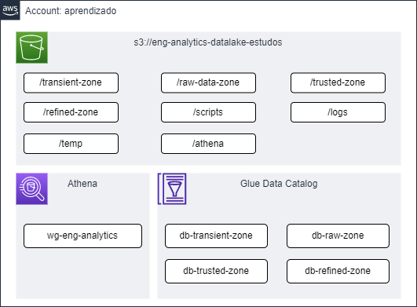

# Infraestrutura Global - AWS

Infraestrutura Global construída na AWS para estudos.

---

## Desenho de Arquitetura

**S3**

Ferramenta de storage dos dados do Data Lake.

* `/transient-zone`: camada para dados temporários que acabaram de ser ingeridos no lake;
* `/raw-data-zone`: camada de dados brutos;
* `/trusted-zone`: camada para dados harmonizados e completos;
* `/refined-zone`: camada para dados especializados e agregados;
* `/scripts`: diretório de scripts dos jobs;
* `/logs`: diretório de logs dos jobs;
* `/temp`: diretório para arquivos temporários dos jobs;
* `/athena`: diretório para armazenar os resultados das querys do Athena.

**Athena**

Ferramenta para análise exploratório e consulta aos dados do data lake.

* `wg-eng-analytics`: workgroup de engenharia de analytics para consultar as tabelas do Glue Data Catalog.

**Glue Data Catalog**

Ferramenta para armazenamento dos metadados do data lake (metastore).

* `db-transient-zone`: database para a camada transient;
* `db-raw-zone`: database para a camada raw;
* `db-trusted-zone`: database para a camada trusted;
* `db-refined-zone`: database para a camada refined.